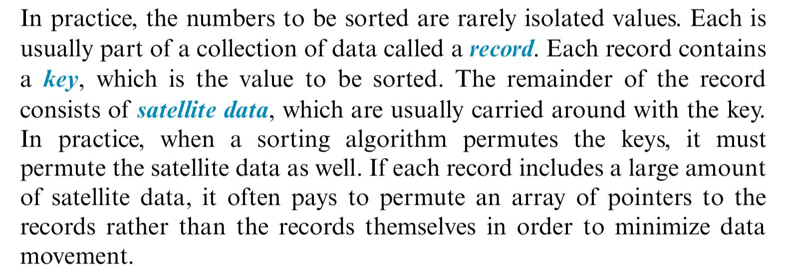
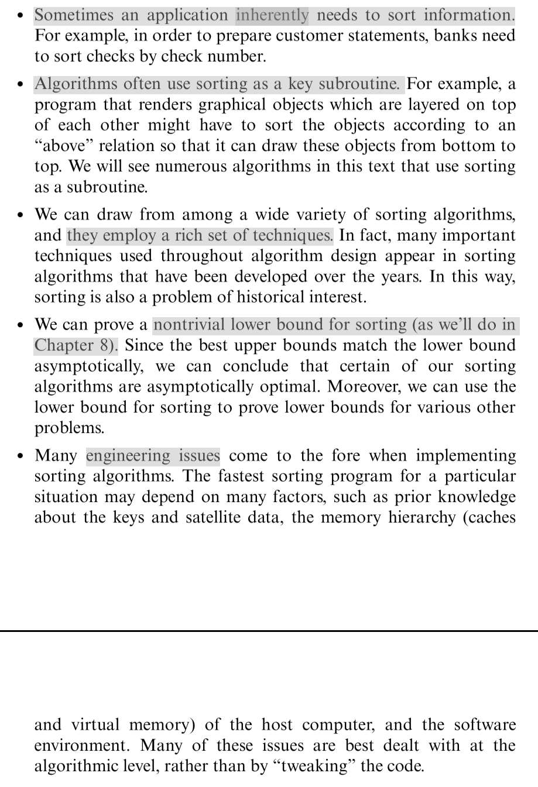
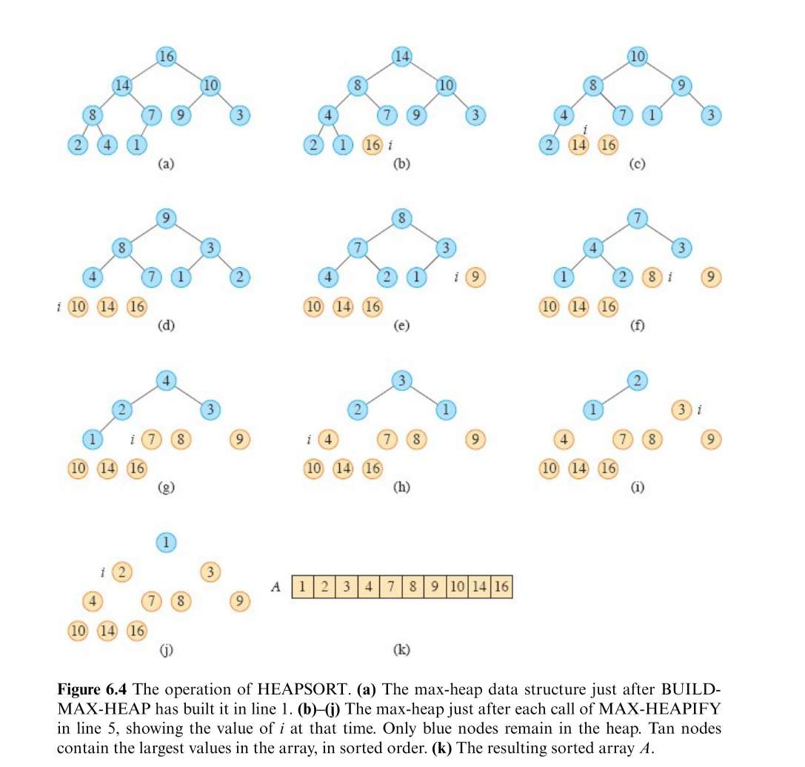
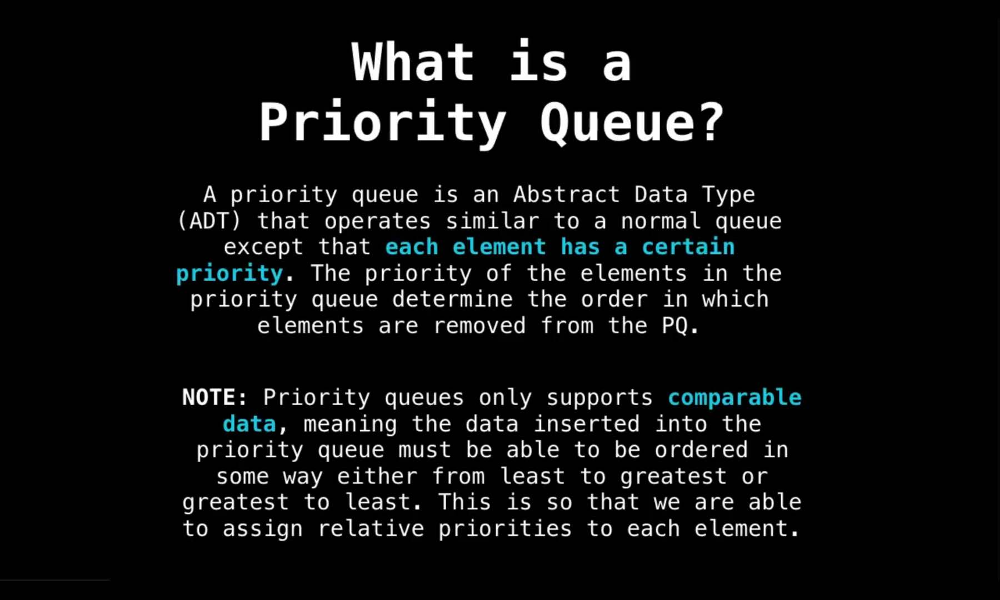
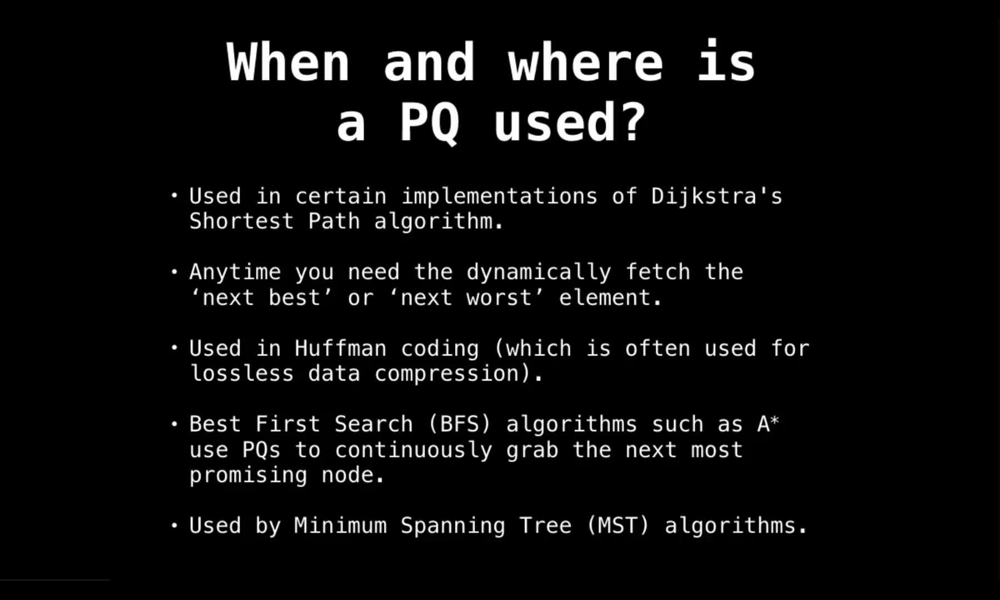
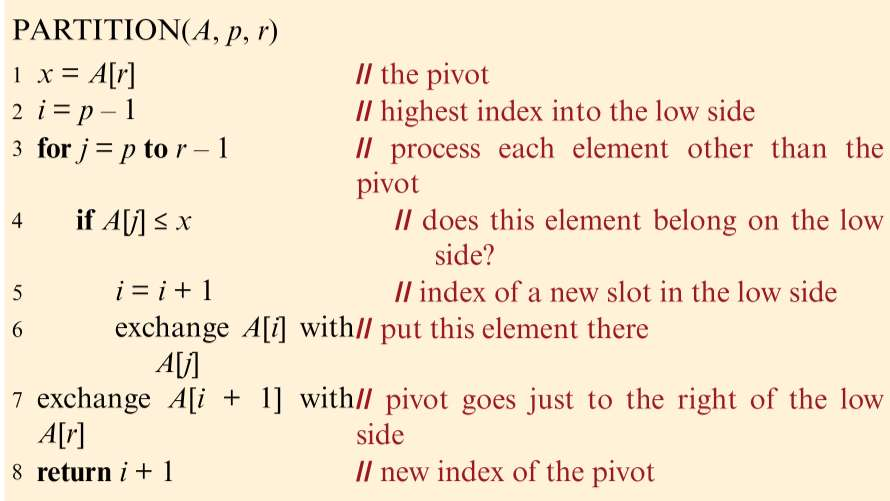
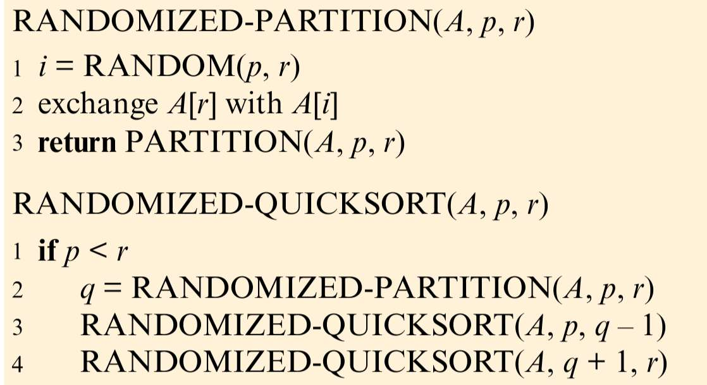

***At this point: *Mon Jul 10 19:56:50 CST 2023*, I decided to concentrate on the 1. *important concept* and 2.typical functions and algorithms only for period of time of future untill I have more professional experience. Then, I will be back to tear this book into pieces!!!!!!!!!!!!!!!***

# Part I Foundations

## Introduction

-   Discribe operations and design
-   mathematical tools
-   devide-and-conquer
-   recursion
-   asymptotic notations
-   the _master method_
-   probabilistic analysis

## 1 The Role of Algorithms in Computing

What are algorithms? Why worthwhile? What is the role relative to other technologies used in computers>

### 1.1 Algorithms

-   concept of _algorithms_:
    > Informally, an algorithm is thus a sequence of conputational steps that transform the input into the output.
    > Slove the problem within finite time.
-   instance of a problem
    > consists of the input needed to compute a solution to the problem.
-   Which algorithm is best depends on many aspects of constraints.
-   correct algorithm

    > if , for every problem instance provided as input, it halts (in finite time) and outputs the correct solution to the problem instance.  
    > incorrect algorithms sometimes is useful, we can control the error rate.

-   **What kinds of problems are solved by algorithms?**
-   Data structures
-   Technique
    > _design_ and _analyze_
-   Hard Problems
    -   most of this book is about efficient algorithms.
        > however, for which we know of no algorithm that runs in a reasonable amount of time.
    -   NP-complete. What is this?
-   Alternative computing models.
    > _task-parrallel_
-   _online algorithms_
    > receive the input over time.

### 1.2 Algorithms as a technology

_infinite time_ and _correct answer_

-   Efficiency
    -   insertion sort: O(n^2)
    -   merge sort: O(n log n)
        > even a poor compiler, when the number is large, merge sort still faster than a better compiler
-   Algorithms and other technologies
    -   algorithms are important as hardware
    -   Machine Learning is a kind of algorithm itself,
        > its success is to solve the problems for which we, as human, do not really understand what the right algorithm is.
    -   Data Science, an interdisciplinary field

## 2 Getting Started

Examining the insertion sort. To use a method called devide-and-conquer to develop a sorting algorithm called merge sort.

### 2.1 Insertion sort

-   The number to be sorted is a key, and a key has satellite data.
-   pseudocode:
    ```
    INSERTION-SORT(A,n)
    for i=2 to n
    key = A[i]
    // insert A[i] into the sorted subarray A[1:i-1]
    j = i - 1
    while j > 0 and a[j] < key
        a[j+1] = A[j]
        j = j - 1
    A[j + 1] = key
    ```
-   loop ivariant:
    > three things of using a loop ivariant
      <!-- > waiting for paste from notes -->

### 2.2 Analyzing algorithms

-   concept of _Analyzing algorithms_:
    -   predicating the resources that the algorithm requires.
    -   memory, communication bandwidth, energy consumption.Most often, **computational time**.
-   _random-access machine (RAM)_

    -   concept of _RAM_:
        -   RAM assumes that each instruction takes the same amount of time as any other instruction and that each data access.
    -   Be careful not to abuse the RAM model.
        -   **_the instruction of sort do not appear in real computers! It is not one step._**
        -   commonly instructions: arithmetic (add, subtract, multiply,divide,remainder,floor,ceiling),data movement (load,store,copy), and control(conditional and unconditional branch, subroutine call and return)
        -   Shift instructions(bit operations)
    -   data types in the RAM model:
        1. integer
        2. floating point(real number)
        3. character
            > **real computer do not usually have boolean values True and False. Instead, 0 and 1**
        4. assume that each word of data has a limit on the number of bits.
    -   RAM model doesn't account for the memory hierachy in contemporary computers.
        > neither caches not virtual memory.
        > but RAM model is usually excellent performance on actual machines.
    -   You might need mathematical tools.

    #### Analysis of insertion sort

    -   first, the running time depends on the input.
    -   _input size_: depends on the problem being studied.
        > example: for sorting , the input size is the number n of items. In multiply, the input size is the number of bits.
    -   _running time_: the number of instructions and data access executed.

    #### Worst-case and average-case analysis

    -   To concentrate on on the worst-case.
        > **_Three reasons at Page 61_**
    -   average-case may the same as worst-case, and it related to _probablistic analysis_.

    #### Order of growth

    > or _rate of growth_ > `Θ`

### 2.3 Designing algorithms

-   _incremental_ method
    > Insertion Sort uses a incremental method

#### 2.3.1 The divide-and-conquer method

-   recursive in structure

---

-   recursive case performed in tree characteristic steps:
    1. divide
    2. conquer
    3. combine

---

-   merge sort:
    -   closely follows the divide-and-conquer method.
    -   the key operation: "combine" step.

#### 2.3.2 Analyzing divede-and-conquer method

-   running time described by a _recurrence equation_ or _recurrence_
-   running time:
    > D: divede; 1/b \* n: size of b problem; C: combine
    > 
-   two convention:
    1. simplification: ignoring floors and ceilings
    2. to omit a statement of the base cases of the recurrence.
        > because the base cases are always T(n)=Θ(1), if `n<n0` or `n>n0`
    ###### Analysis of merge sort
    -   Divide: D(n)=Θ(1).
        > just compute the middle of the subarray
    -   Conquer: 2T(n/2)
        > solving two subproblems, each of size n/2
    -   Combine: C(n)=Θ(n)
        > Merge procedure on an n-element subarray.
        > So, sum of them is `T(n)=2T(n/2)+Θ(n)`.
    -   Θ(n log n)
        -   rows(levels): divide = log n
        -   columns(elements): each touched once => n

## 3 Characterizing Running Times

Usually, an algorithm that is asymptotically more efficient is the best choice for all but very small inputs.

### 3.1 Ο-notation, Ω-notation, and Θ-notation

###### Ο-notation

-   concept of _Ο-notation_:
    > `7n^3+100n^2-20n+6`. It's highest order is 7n^3, this function's rate of growth is n^3, no faster than n^3. Thus, Ο(n^3), and also Ο(n^4) and Ο(n^5) and so on.
-   More generally, it is Ο(n^c) for any constant c>=3.

###### Ω-notation

-   concept of _Ω-notation_
    -   at least fast as.
    -   Ω(n^c), c<=3. Ω(n^3),Ω(n^2),Ω(n^1) and so on.

###### Θ-notation

-   concept of `Θ-notation`:
    -   **precisely** at a certain rate
    -   based--once again--on the highest-order term.
    -   **_if a function both Ο(n^3) and Ω(n^3),then Θ(n^3)_**

### 3.2 Asymptotic notation: formal definitions

> **_notice that this chapter 3.2 is skipped, it's not understandable for me now._**  
> **_time:Mon Jul 10 16:27:21 CST 2023_**


###### Ο-notation

**_TOO PROFESSIONAL FOR ME TO UNDERSTAND, just skipped this chapter!_**

-   Big O is a upper bound
-   Ω is a lower bound
-   Θ is a tight bound

---

**_Theorem 3.1_**  
For any two functions `f(n)` and `g(n)`, we have `f(n) = Θ(g(n))` if and only if `f(n) = Ο(g(n))` and `f(n) = Ω(g(n))`.

---

###### Asymptotic notation and running times

-   When use _Asymptotic notation_
    > make sure as precise as possible without overstating which running time it applies to.

###### Asymptotic notation in equations and inequations

###### Proper abuses of asymptotic notation

**o-notation**
**ω-notation**

### 3.3 Standard notations and common functions

**_JUST FOR KNOW!_**

###### Monotonicity

...

###### Floors and ceilings

Obey the following properties:  


###### Modular arithmetic


###### Polynomials


###### Exponentials

###### Logarithms

###### Factorials

###### Functional iteration


###### The iterated logarithm function

###### Fibonacci numbers

## Divide-and-Conquer

-   **Divede** the problem into subproblems
-   **Conquer** the subproblems by solving them recursively.
-   **Combine** the subproblem solutions to form a solution to the original problem.

> The recursion _bottoms out_ when it reaches a base case and the subproblem is small enough to solve directly without further recursing.

###### Recurrence

-   general form:
    -   an equation or inequality that describes a function over the integers or reals using the function itself.
    -   It contains two or more cases, depending on the argument.
    -   _recursive case_: involves the recursive invocation
    -   _base case_: not involve a recursive invocation.
    -   _well difined_: if there is at least one fuction that satisfies it
        > and _ill defined_ otherwise

###### Algorithmic recrrences

-   for every sufficient large threshold constant `n0>0`, the following two properties
    1. For all `n<n0`, we have T(n)=Θ(1).
    2. For all `n>=n0`, termination is in a defined base case within a finite number of recursive invocations.
-   Conventions for recurrences
    > **_Whenever a recurrence is stated without an explicit base case, we assume that the recurrence is algorithmic._**

###### Divide-and-Conquer and Recurrences

###### Solving recurrences

-   four methods:
    

### 4.1 Multiplying square matrices

-   triple loop:
    -   1-4: row
    -   2-4: column
    -   3-4: add a polynomial
        
-   divide-and-conquer
    -   base case: `n == 1`. `c11=c11+a11*b11`
    -   divide to n/2
    -   conquer: recurrences
        

### 4.2 Strassen's algorithm for matrix multiplication

### 4.3 The substitution method for solving recurrences

---

...A bunch of prove details...

---

-   two steps:
    1. Guess the form of the solution using symbolic constants.
    2. Use mathematical induction to show that the solution works, and find the constants.

###### Making a good guess

-   no general way
-   need experiences and creativity.

###### A trick of the trade: subtracting a low-order term

###### Avoid pitfalls

Avoid using asymptotic notation in the inductive hypothesis for the substitution method because it's errror prone.

### 4.4 the recursion-tree method for solving recurrences

simplify to a geometric

### 4.5 the master method for solving recurrences

-   **Three cases:**
    

## 5 Porbabilistic Analysis and Randomized Algorithms

### 5.1 The hiring problem

-   **probilistic**:
    -   each `n!` has the equal probability
-   **randomized algorithms**
    -   algorithm _randomized_: if its behavior not only determined by its input but also by values produced by a _random-number generator_.

### Indicator random variables


###### Analysis of the hiring problem using indicator random variables

**SKIPPED!!!!!!!!!!!**

### 5.3 Randomized algorithms

concept: _uniform random permutation_

# Part II Sorting and Order Statistics

---

###### **Introduction**

This part presents several algorithms that solve the following _sorting problem_:


###### The structure of data

-   _record_
-   _key_
-   _satellite data_
    

###### Why sorting?



###### Soring algorithms

-   _in place_:
    -   insertion sort sorts _in place_.
    -   merge sort, the procedure does not operate in place.
-   sorting algorithms analysis table:
    

###### Order statistics

###### Background

probability needs mathematical tools.

---

## Heapsort

---

-   running time: Ο(n log n)
-   sorts in place
-   a data structure: _heap_
-   ***here, the term of *heap* does not refer to the storage class, it's a data structure.***

---

### 6.1 Heaps

-   concept of a heap
    -   _(binary) heap_ data structure
    -   is an array object
    -   that we can view as a nearly complete binary tree.
    -   each node of the tree corresponds to an element of the array.
    -   PARENT,LEFT,RIGHT
        > The root of the tree is A[1], and given the index i of a node, there’s a simple way to compute the indices of its parent, left child, and right child with the one-line procedures PARENT, LEFT, and RIGHT.
        > 
    -   find parent, left child, and right child  
         
    -   two kinds of heaps, satisfying a _heap-property_:
        -   max-heaps
            > in a _max-heap_, for every node other than the root: `A[PARENT(i)]>=A[i]`
        -   min-heaps
            > in a _min-heap_, for every node other than the root: `A[PARENT(i)]<=A[i]`
    -   define the _height_ of a node: `Θ(log n)`.
        > as for it's a complete binary tree.
    -   some basic procedures:
        -   The **MAX-HEAPIFY** procedure, which runs in O(lg n) time, is the key to maintaining the max-heap property.
        -   The **BUILD-MAX-HEAP** procedure, which runs in linear time, produces a max-heap from an unordered input array.
        -   The **HEAPSORT** procedure, which runs in O(n lg n) time, sorts an array in place.
        -   The procedures **MAX-HEAP-INSERT, MAX-HEAP-EXTRACT-MAX, MAX-HEAP-INCREASE-KEY, and MAX-HEAP-MAXIMUM** allow the heap data structure to implement a priority queue. They run in O(lg n) time plus the time for mapping between objects being inserted into the priority queue and indices in the heap.

### 6.2 Maintaining the heap proerty

-   _heap-size_:
-   figure MAX-HEAPIFY
    ```
        MAX-HEAPIFY(A, i)
    1       l = LEFT(i)
    2       r = RIGHT(i)
    3       if l ≤ A.heap-size and A[l] > A[i]
    4         largest = l
    5       else largest = i
    6       if r ≤ A.heap-size and A[r] > A[largest]
    7         largest = r
    8       if largest ≠ i
    9         exchange A[i] with A[largest]
    1         MAX-HEAPIFY(A, largest)
    ```
-   time complexity: `Ο(log n)`

### 6.3 Building a heap

-   the procedure:

    > by calling max-heapify in a bottom-up manner

    ```
        BUILD-MAX-HEAP(A, n)
    1       A.heap-size = n
    2       for i = ⌊n/2⌋ downto 1
    3           MAX-HEAPIFY(A, i)
    ```

-   time complexity: `Ο(n log n)`

### The heapsort algorithm

-   the procedure:

    ```
        HEAPSORT(A, n)
    1       BUILD-MAX-HEAP(A, n)
    2       for i = n downto 2
    3           exchange A[1] with A[i]
    4           A.heap-size = A.heap-size – 1
    5           MAX-HEAPIFY(A, 1)
    ```

    

-   time complexity: `Ο(n log n)`

### 6.5 Priority queues

---

**From youtube:**  
[What is priority queue: ](https://youtu.be/wptevk0bshY)


When and where to use:  

Complexity:  


---

-   max-priority queues and min-priority queues.
    > to implement max-priority queues in this book.
-   operations:

    -   INSERT(S, x, k) inserts the element x with key k into the set S, which is equivalent to the operation S = S ⋃ {x}.
        > `Ο(log n)`
    -   MAXIMUM(S) returns the element of S with the largest key.
        > `Ο(1)`
    -   EXTRACT-MAX(S) removes and returns the element of S with the largest key.
        > `Ο(log n)`
    -   INCREASE-KEY(S, x, k) increases the value of element x’s key to the new value k, which is assumed to be at least as large as x’s current key value.
        > `Ο(log n)`

-   uses:
    -   Among their other applications, you can use max-priority queues to schedule jobs on a computer shared among multiple users.
    -   A min-priority queue can be used in an event-driven simulator.
-   methods to add application objects to the priority queue:
    -   handles, a hidden index.
    -   hashtable
-   Algorithms,pseudocodes:
      
    

## Quicksort

---

-   worst-case `Θ(n^2)`
-   but remarkably efficient on average: excepted running time is `Θ(n lg n)`.
-   sorting in place

---

### 7.1 Description of quicksort

-   three steps:
    -   **Divide** by partitioning (rearranging) the array A[p : r] into two (possibly empty) subarrays A[p : q – 1] (the low side) and A[q + 1 : r] (the high side) such that each element in the low side of the partition is less than or equal to the pivot A[q], which is, in turn, less than or equal to each element in the high side. Compute the index q of the pivot as part of this partitioning procedure.
    -   **Conquer** by calling quicksort recursively to sort each of the subarrays A[p : q – 1] and A[q + 1 : r].
    -   **Combine** by doing nothing: because the two subarrays are already sorted, no work is needed to combine them. All elements in A[p : q – 1] are sorted and less than or equal to A[q], and all elements in A[q + 1 : r] are sorted and greater than or equal to the pivot A[q]. The entire subarray A[p : r] cannot help but be sorted!
-   pseudocode:
    > **input**: array A[1:n], initial call QUICKSORT(A,1,n)  
    > **output**: sorted A
    > 

###### Partitioning the array

-   pseudocode:
    > 
-   initialization, maintenance, termination of the loop
    -   **initialization**: `i=p-1` and `j=p`.
    -   **maintenance**: if `A[j] > x`, then increment `j` but i, else if `A[j] <= x`, increment `i`, swaps `A[j]` and `A[i]`, and then increment `j`.
    -   **termination**: `j > r-1`.

### 7.2 Performance of quicksort

---

It depends on how balanced the pivot.

---

###### Worst-case partitioning

-   **occurs** when the partitioning produces one subproblem with `n-1` elements and one with 0 elements.
-   `T(n) = T(n-1) + T(0) + Θ(n) = T(n-1) + Θ(n)`.
-   `Θ(n^2)`. which case that is always sorted.

###### Best-case partitioning

-   **in the most even possible split**, **PARTITION** produces two subproblems, each of size no more than `n/2`.
-   `T(n) = 2T(n/2) + Θn`.
-   `Θ(n lg n)`

###### Balanced partitioning

-   always produces a `9-to-1` proportional split.
-   `T (n) = T (9n/10) + T (n/10) + Θ(n)`
-   `Ο(n lg n)`
    > 

###### Intuition for the average case


### 7.3 A randomized version of quicksort



### 7.4 Analysis of quicksort

**_TOO PROFESSIONAL, JUST SKIPPED!!!!!!!_**

## 8 Sorting in Linear Time

---

_comparison sorts_:  
These algorithms share an interesting property: the sorted order they determine is based only on comparisons between the input elements. We call such sorting algorithms comparison sorts. All the sorting algorithms introduced thus far are comparison sorts.

**_Any comparison sort must make `Ω(n lg n)` comparisons in the worst case to sort `n` elements._**

---

### 8.1 Lower bounds for sorting

**_ASSUME WITHOUT LOSS OF GENERALITY IN THIS SECTION THAT ALL THE INPUT ELEMENTS ARE DISTINCT._**

###### The _dicision-tree_ model

-   the concept of _dicision-tree_:
    -   is a full binary tree
        > 

###### A lower bound for the worst case

-   the height of its decision tree
    > Consequently, the worst-case number of comparisons for a given comparison sort algorithm equals the height of its decision tree.
-   ###### Theorem 8.1
    ###### Corollary 8.2
    > 

### 8.2 Counting sort

---

_Counting sort_ assumes that each of the `n` input elements is an integer in the range `0` to `k`, for some integer `k`. It runs in `Θ(n + k)` time, so that when `k = O(n)`, counting sort runs in `Θ(n)` time.

**_From YouTube:_**

**Video**: [counting sort](https://youtu.be/OKd534EWcdk)

---

-   COUNTING-SORT pseudocode:
    > ```
    > COUNTING-SORT(A,n,k)
    >     create new B[1:n] and C[0:k]
    >     for i=0 to k
    >         C[i] = 0
    >     for j=1 to n
    >         C[A[j]]  = C[A[j]] + 1
    >     for i=1 to k
    >         C[i] = C[i] + C[i-1]
    >     for j=n down to 1
    >         B[C[A[j]]] = A[j]
    >         C[A[j]] = C[A[j]] - 1
    >     return B
    > ```
    >
    > The COUNTING-SORT procedure on the facing page takes as input an array A[1 : n], the size n of this array, and the limit k on the nonnegative integer values in A. It returns its sorted output in the array B[1 : n] and uses an array C [0 : k] for temporary working storage.
    >  > 

### 8.3 Radix sort

---

**EXTERNAL RESOURCES:**  
_counting sort_ is a _stable sort_:

> A stable sort algorithm is a sorting algorithm that **preserves the relative order of equal elements** in the input data set¹². For example, if you have a list of names and ages, and you sort them by age, a stable sort algorithm will keep the original order of names with the same age. An unstable sort algorithm may change the order of names with the same age.
>
> Stable sorting algorithms are useful when you have **distinguishable elements** with **multiple attributes** that you want to sort by²³. For example, if you want to sort a list of words by their frequency and then by their alphabetical order, you can use a stable sort algorithm to preserve the lexicographical order after sorting by frequency.
>
> Some examples of stable sorting algorithms are **bubble sort, insertion sort, merge sort, and counting sort**¹². Some examples of unstable sorting algorithms are **quick sort, heap sort, and selection sort**¹². Some unstable sorting algorithms can be modified to be stable by taking into account the position of the elements in the input data set¹⁴.
>
> Source: Conversation with Bing, 7/14/2023
> (1) Stable and Unstable Sorting Algorithms - GeeksforGeeks. https://www.geeksforgeeks.org/stable-and-unstable-sorting-algorithms/.
> (2) Stable Sorting Algorithms | Baeldung on Computer Science. https://www.baeldung.com/cs/stable-sorting-algorithms.
> (3) Sorting algorithm - Wikipedia. https://en.wikipedia.org/wiki/Sorting_algorithm.
> (4) Stability in Sorting Algorithms — A Treatment of Equality. https://www.freecodecamp.org/news/stability-in-sorting-algorithms-a-treatment-of-equality-fa3140a5a539/.

**From youtube:**
**IT'S IMPORTANT TO USE A _STABLE SORT_ AS THE SUBROUTINE OF RADIX SORT**, which is that counting sort is a stable sort.

Video: [radix sort](https://youtu.be/XiuSW_mEn7g)

---

-   the concept of _Radix sort_
    -   used by the card-sorting machines
    -   you now find only in computer museums.
-   pseudocode:

    > 

-   ###### Lemma 8.3

> **Lemma 8.3**  
> Given n d-digit numbers in which each digit can take on up to k possible values, RADIX-SORT correctly sorts these numbers in Θ(d(n + k)) time if the stable sort it uses takes Θ(n + k) time.  
> **Proof**  
> The correctness of radix sort follows by induction on the column being sorted (see Exercise 8.3-3). The analysis of the running time depends on the stable sort used as the intermediate sorting algorithm.
> When each digit lies in the range 0 to k – 1 (so that it can take on k possible values), and k is not too large, counting sort is the obvious choice. Each pass over n d-digit numbers then takes Θ(n + k) time.
> There are d passes, and so the total time for radix sort is Θ(d(n + k)).

-   ###### Lemma 8.4

> **Lemma 8.4**  
> Given n b-bit numbers and any positive integer r ≤ b, RADIX-SORT correctly sorts these numbers in Θ((b/r)(n + 2r)) time if the stable sort it uses takes Θ(n + k) time for inputs in the range 0 to k.  
> **Proof**  
> For a value r ≤ b, view each key as having d = ⌈b/r⌉ digits of r bits each. Each digit is an integer in the range 0 to 2r – 1, so that we can use counting sort with k = 2r – 1. (For example, we can view a 32-bit word as having four 8-bit digits, so that b = 32, r = 8, k = 2r – 1 = 255, and d = b/r = 4.) Each pass of counting sort takes Θ(n + k) = Θ(n + 2r) time and there are d passes, for a total running time of Θ(d(n + 2r)) = Θ((b/r) (n + 2r)).
> ▪

-   Is radix sort preferable to a comparison-based sorting algorithm, such as quicksort?

    > If b = O(lg n), as is often the case, and r ≈ lg n, then radix sort’s running time is Θ(n), which appears to be better than quicksort’s expected running time of Θ(n lg n).

-   does not sort in place with counting sort
    > the version of radix sort that uses counting sort as the intermediate stable sort does not sort in place

### 8.4 Bucket sort

---

**From YouTube:**
Video: [Bucket sort](https://youtu.be/VuXbEb5ywrU)

---

-   the concept of a _bucket sort_
    -   the input is drawn from a uniform distribution
    -   and has an average-case running time of `Ο(n)`.
-   pseudocode
    >   
    > 

## 9 Medians and Order Statistics

---

Intro

> 

---

### 9.1 Minimum and maximum

-   The Minimum procedure
    > array A[1:n]  
    > **psedocode**:  
    > 

###### Simutaneous minimum and maximum

If n is even, 1 initial comparison occurs, followed by another `3(n – 2)/2` comparisons, for a total of `3n/2 – 2`. Thus, in either case, the total number of comparisons is at most `3 ⌊n/2⌋`.

### 9.2 Selection in expected linear time

-   pseudocode
    > 
-   figure

    > 

-   ###### Lemma 9.1
    -   A partitioning is helpful with probablility at least `1/2`.
    -   proof:
        > 
-   ###### Theorem 9.2
    -   The procedure Randomized-select on an input array of n distinct elements has an expected running time of `Θ(n)`.
    -   proof:
        > .jpg>)  
        > .jpg>)  
        > .jpg>)  
        > .jpg>)

### 9.3 Selection in worst-case linear time

---

From YouTube:
Video: [worst-case linear time](https://youtu.be/XMSvY5Sk4zk)

---

-   ###### Theorem 9.3
    > The running time of **SELECT** on an input of `n` element is `Θ(n)`.

# Part III Data Structures

---

## Introduction

-   sets that is _dynamic_
    > Sets that can grow, shrink, or therwise change over time.
-   _dictionary_
    > Algorithms may require several types of operations to be performed
    > on sets. For example, many algorithms need only the ability to insert
    > elements into, delete elements from, and test membership in a set. We
    > call a dynamic set that supports these operations a _dictionary_.

###### Elements of a dynamic set

-   typically, each element is represented by an object whose attributes can be examined and manipulated given a pointer to the object.
-   _key_
-   _satellite data_

###### Operations on dynamic sets

-   two categories
    -   _queries_
    -   _modifying operations_
-   operations:
    -   SEARCH(S, k)
        > A query that, given a set S and a key value k, returns a pointer x to
        > an element in S such that x.key = k, or `NIL` if no such element
        > belongs to S.
    -   INSERT(S, x)
        > A modifying operation that adds the element pointed to by x to the
        > set S. We usually assume that any attributes in element x needed by
        > the set implementation have already been initialized.
    -   DELETE(S, x)
        > A modifying operation that, given a pointer x to an element in the
        > set S, removes x from S. (Note that this operation takes a pointer to
        > an element x, not a key value.)
    -   MINIMUM(S) and MAXIMUM(S)
        > Queries on a totally ordered set S that return a pointer to the
        > element of S with the smallest (for MINIMUM) or largest (for
        > MAXIMUM) key.
    -   SUCCESSOR(S, x)
        > A query that, given an element x whose key is from a totally ordered
        > set S, returns a pointer to the next larger element in S, or `NIL` if x is
        > the maximum element.
    -   PREDECESSOR(S, x)
        > A query that, given an element x whose key is from a totally ordered
        > set S, returns a pointer to the next smaller element in S, or `NIL` if x
        > is the minimum element.

---

## 10 Elementry Data Structures

data structures that using pointers. Only rudimentary ones:

-   arrays
-   matrices
-   stacks
-   queues
-   linked lists
-   rooted trees

### 10.1 Simple array-based data structures: arrays, matrices, stacks, queues

#### 10.1.1 Arrays

-   the concept of arrays
    > We assume that, as in most programming languages, an array is stored
    > as a contiguous sequence of bytes in memory
-   pointers' bytes the same
    > The number of bytes occupied by a
    > pointer is typically the same, no matter what the pointer references, so
    > that to access an object in an array, the above formulas give the address
    > of the pointer to the object and then the pointer must be followed to
    > access the object itself.
-   four ways to store the `2 x 3` matrix M.
    > 

#### 10.1.2 Matrices

-   two most common ways to store a matrix.

    -   _row-major order_
    -   _column-major order_

    > 

-   _block representation_
    > 

#### 10.1.3 Stacks and queues

-   _stack_
    > LIFO
-   _queue_
    > FIFO

###### **Stacks**

-   operations:
    -   INSERT
        > called `PUSH`
    -   DELETE
        > called `POP`
-   attributes:
    -   S.top
        > indexing the most recently inserted element
    -   S.size
        > equaling the size `n` of the array
-   **figure 10.2**
    > 
-   STACK-EMPTY to check if the stack is empty
    -   _underflow_
        > to pop an empty stack, the stack underflows
    -   _overflow_
        > if S.top exceeds S.size, the stack overflows
    -   three operations takes `Ο(1)`:
        > The procedures `STACK-EMPTY`, `PUSH`, and `POP` implement each
        > of the stack operations with just a few lines of code. Figure 10.2 shows
        > the effects of the modifying operations `PUSH` and `POP`. Each of the
        > three stack operations takes `O(1)` time.
        > 

###### **Queues**


-   oprations:
    -   INSERT
        > `ENQUEUE`
    -   DELETE
        > `DEQUEUE`
-   attributes:
    -   `Q.head`
    -   `Q.tail`
    -   `Q.size`
-   procedures takes `Ο(1)`:
    > 

### 10.2 Linked lists

-   the concept of linked lists
    -   objects
    -   arranged in a linear order
    -   the order is determined by a _pointer_ in each object. Not be like arrays ordered by index.
    -   often contains _keys_
        > sometimes called _search lists_
-   figure _doubly linked list_
    > 
    -   `x.next`, `x.prev` and `NIL`
        > As shown in Figure 10.4, each element of a doubly linked list L is an
        > object with an attribute key and two pointer attributes: next and prev.
        > The object may also contain other satellite data. Given an element x in
        > the list, `x.next` points to its successor in the linked list, and `x.prev` points
        > to its predecessor. If `x.prev` = `NIL`, the element x has no predecessor
        > and is therefore the first element, or head, of the list. If `x.next` = `NIL`,
        > the element x has no successor and is therefore the last element, or tail,
        > of the list. An attribute L.head points to the first element of the list. If
        > L.head = `NIL`, the list is empty.
-   A list have one of **several forms**
    -   _singly linked_ or _doubly linked_
    -   _sorted_ or _not sorted_
        > If a list is sorted, the linear order of the list corresponds to the
        > linear order of keys stored in elements of the list. The minimum element
        > is then the head of the list, and the maximum element is the tail. If the
        > list is unsorted, the elements can appear in any order.
    -   _circular list_
        > In a circular list,
        > the prev pointer of the head of the list points to the tail, and the next
        > pointer of the tail of the list points to the head

###### Searching a linked list

-   procedure LIST-SEARCH(L, k)
    -   finds the first element with key `k` in list `L` by a simple linear search,
    -   returning a _pointer_ to this element.
    -   takes `Θ(n)`
        > 

###### Inserting into a linked list

_splices_

-   procedure LIST-PREPEND(L, k)
    -   add x to the front of the linked list
    -   running time: `Ο(1)`
        > 
-   procedure LIST-INSERT(x,y)
    -   add x to anywhere in the linked list
    -   running time: `Ο(1)`
        > You can insert anywhere within a linked list. As Figure 10.4(c)
        > shows, if you have a pointer y to an object in the list, the LIST-INSERT
        > procedure on the facing page “splices” a new element x into the list,
        > immediately following y, in O(1) time. Since LIST-INSERT never
        > references the list object L, it is not supplied as a parameter
        > 

###### Deleting from a linked list

_splices_

-   procedure LIST-DELETE(L,x)
    -   removes an element from a linked list `L`.
    -   must be given a pointer to `x`
    -   spices `x` out of the list by updating pointers.
    -   running time: `Ο(1)`. but to delete an element with a given key, the call to list-search makes the worst-case running time be `Θ(n)`.
        > 

###### Sentinels

> 

-   the concept of a _sentinel_
    -   is a dummy object
    -   that allows us to simplify boundary conditions.
-   procedures
    -   list-delete
        > 
    -   list-insert
        > 
    -   list-search
        > 

### 10.3 Representing rooted trees

---

-   key.
-   pointers, _vary according to the type of tree._

---

###### Binary trees

> 

-   attributes:
    -   `p`
        > pointers to the parent
    -   `left`
        > left child
    -   `right` > right child
        > If `x.p = NIL`, then `x` is the root. If node `x` has no left
        > child, then `x.left = NIL`, and similarly for the right child. The root of
        > the entire tree `T` is pointed to by the attribute `T.root`. If `T.root = NIL`,
        > then the tree is empty.

###### Rooted trees with unbounded branching

> 

-   attributes:
    -   p
    -   left-child
    -   right-sibling
        > If node `x` has no children, then `x.left-child = NIL`, and if node `x` is the
        > rightmost child of its parent, then `x.right-sibling = NIL`.

###### Other tree representations

> We sometimes represent rooted trees in other ways. In Chapter 6, for
> example, we represented a _heap_, which is based on a complete binary
> tree, by a single array along with an attribute giving the index of the last
> node in the _heap_. The trees that appear in Chapter 19 are traversed only
> toward the root, and so only the parent pointers are present: there are
> no pointers to children. Many other schemes are possible. **Which scheme is best depends on the application.**

## 11 Hash Tables

---

## the basic dictionary operations require only `Ο(1)` time on the average.

### 11.1 Direct-address tables

-   works well when univers U of keys is reasonably small.
-   operations: DIRECT-ADDRESS-SEARCH, DIRECT-ADDRESS-INSERT, DIRECT-ADDRESS-DELETE
    > Each takes only `Ο(1)` time.
-   implement a direct-address table:
    > 
-   procedure:
    > 

### 11.2 Hash tables

-   _hash function_
    > use a hash function `h` to compute the slot number from the key `k`, so the element goes into `h(k)`.
-   `h` maps `U` of keys into the slots of a hash table `T[0:m-1]: h:U -> {0,1,...,m-1}`.
-   an element with key `k` hashes to slot `h(k)`, and we also say that `h(k)` is the hash table of key `k`.
-   figure hash table
    > Instead of a size of |U|, the array can have size m. An example of a
    > simple, but not particularly good, hash function is h(k) = k mod m.
    -   _collision_
        > There is one hitch, namely that two keys may hash to the same slot.
        > We call this situation a collision.
        -   figure collision:
            > 
    -   to be random
        > make h appear to be “random,” thus avoiding collisions
        > or at least minimizing their number. The very term “to hash,” evoking
        > images of random mixing and chopping, captures the spirit of this
        > approach. (Of course, a hash function h must be deterministic in that a
        > given input k must always produce the same output h(k).)

###### Independent uniform hashing

-   the concept of _independent uniform hash function_
    -   An "ideal" hashing function `h`
    -   for each possible input k in the domain `U`,
    -   an output `h(k)` that is an element randomly and independently
    -   chosen uniformly from the range `{0,1,2,...,m-1}`.
    -   Once `h(k)` , each same input `k` yields the same output `h(k)`.
        > often called a _random oracle_. A statement of "using _independent uniform hashing_".

###### Collision resolution by chaining

-   figure of Collision resolution by chaining:
    > 
-   procedure
    > 

###### Analysis of hashing with chaining

-   _load factor_ `α`:
    > Given a hash table `T` with `m` slots that stores `n` elements, we define
    > the load factor `α` for `T` as `n/m`, that is, the average number of elements
    > stored in a chain. Our analysis will be in terms of `α`, which can be less
    > than, equal to, or greater than `1`.
-   hash function is _uniform_

###### Theorem 11.1

> **Theorem 11.1**  
> In a hash table in which collisions are resolved by chaining, an
> unsuccessful search takes Θ(1 + α) time on average, under the
> assumption of independent uniform hashing.
>
> **Proof** Under the assumption of independent uniform hashing, any key
> k not already stored in the table is equally likely to hash to any of the m
> slots. The expected time to search unsuccessfully for a key k is the
> expected time to search to the end of list T[h(k)], which has expected
> length E[nh(k)] = α. Thus, the expected number of elements examined in
> an unsuccessful search is α, and the total time required (including the
> time for computing h(k)) is Θ(1 + α).
> ▪

###### Theorem 11.2

> **Theorem 11.2**  
> In a hash table in which collisions are resolved by chaining, a successful
> search takes Θ(1 + α) time on average, under the assumption of
> independent uniform hashing.
> **_PROOF IS TO LONG_**

### 11.3 Hash functions

-   two adhoc approaches in this section:

    -   hashing by division
    -   hashing by multiplication

    > They are limited because they try to provide a single fixed hash function that works well on any data -- an approach called _static hashing_

###### What makes a good hash function?

A good hash function statisfies (approximately) the assumption of independent uniform hashing:

-   each key is equally likely to hash to any of the m slots
-   independently of where any other keys have hashed to.

###### Keys are integers, vectors, or strings

> In practice, a hash function is designed to handle keys that are one of
> the following two types:
>
> -   A short nonnegative integer that fits in a `w`-bit machine word.
>     Typical values for `w` would be 32 or 64.
> -   A short vector of nonnegative integers, each of bounded size. For
>     example, each element might be an 8-bit byte, in which case the
>     vector is often called a (byte) string. The vector might be of
>     variable length.

#### 13.1.1 Static hashing

-   the concept of _static hashing_
    -   using a
    -   single
    -   fixed
    -   function
-   two standard approaches:
    -   multiplication
    -   division
-   is no longer recommended now.

###### The division method

-   concept
    > The division method for creating hash functions maps a key `k` into one of
    > `m` slots by taking the remainder of `k` divided by `m`. That is, the hash
    > function is
    > `h(k) = k mod m`.
-   limitation:
    > The division method may work well when m is a prime not too close
    > to an exact power of 2. There is no guarantee that this method provides
    > good average-case performance, however, and it may complicate
    > applications since it constrains the size of the hash tables to be prime.

###### The multiplication method

The general multiplication method for creating hash functions operates
in two steps. First, multiply the key k by a constant A in the range `0 < A < 1` and extract the fractional part of `kA`. Then, multiply this value by `m`
and take the floor of the result. That is, the hash function is
`h(k) = ⌊m (kA mod 1)⌋`,
where “kA mod 1” means the fractional part of kA, that is, `kA − ⌊kA⌋`.
The general multiplication method has the advantage that the value of
`m` is not critical and you can choose it independently of how you choose
the multiplicative constant `A`.

###### The multiply-shift method

> 

>   
>   
> 

#### 11.3.2 Random hashing

-   random hashing
-   universal hashing

> The only effective way to improve the situation is to choose the hash
> function randomly in a way that is independent of the keys that are
> actually going to be stored. This approach is called random hashing. A
> special case of this approach, called universal hashing, can yield provably
> good performance on average when collisions are handled by chaining,
> no matter which keys the adversary chooses.

###### Corollary 11.3

> **Corollary 11.3**  
> Using universal hashing and collision resolution by chaining in an
> initially empty table with m slots, it takes Θ(s) expected time to handle
> any sequence of s INSERT, SEARCH, and DELETE operations
> containing n = O(m) INSERT operations.
>
> **Proof** The INSERT and DELETE operations take constant time.
> Since the number n of insertions is O(m), we have that α = O(1).
> Furthermore, the expected time for each SEARCH operation is O(1),
> which can be seen by examining the proof of Theorem 11.2. That
> analysis depends only on collision probabilities, which are 1/m for any
> pair k1, k2 of keys by the choice of an independent uniform hash
> function in that theorem. Using a universal family of hash functions
> here instead of using independent uniform hashing changes the
> probability of collision from 1/m to at most 1/m. By linearity of
> expectation, therefore, the expected time for the entire sequence of s
> operations is O(s). Since each operation takes Ω(1) time, the Θ(s) bound
> follows.
> ▪

> **UNIVERSAL HASHING FROM BING**:  
> Universal hashing is a technique for designing hash functions that reduces the probability of collisions. It involves choosing a hash function at random from a family of hash functions that have a certain mathematical property. ¹
>
> The mathematical property is that for any two distinct keys, the chance of them having the same hash value is low, regardless of the distribution of keys. Formally, a family of hash functions H is called universal if for any x and y in the key space, Pr[h(x) = h(y)] ≤ 1/m, where h is a random function from H and m is the number of slots in the hash table. ²
>
> Universal hashing has many applications in computer science, such as implementing hash tables, randomized algorithms, and cryptography. It can avoid the worst-case scenario of hashing, where an adversary can choose keys that cause many collisions and degrade the performance of hashing. ³
>
> Here are some links that explain more about universal hashing:
>
> ¹: [Universal hashing - Wikipedia](https://en.wikipedia.org/wiki/Universal_hashing)
> ²: [Introduction to Universal Hashing in Data Structure - GeeksforGeeks](https://www.geeksforgeeks.org/introduction-to-universal-hashing-in-data-structure/)
> ³: [Universal Hashing - An Clear Explanation - Kindson The Genius](https://www.kindsonthegenius.com/universal-hashing/)
>
> Source: Conversation with Bing, 7/15/2023
> (1) Universal hashing - Wikipedia. https://en.wikipedia.org/wiki/Universal_hashing.
> (2) Introduction to Universal Hashing in Data Structure. https://www.geeksforgeeks.org/introduction-to-universal-hashing-in-data-structure/.
> (3) Universal Hashing - An Clear Explanation - Kindson The Genius. https://www.kindsonthegenius.com/universal-hashing/.

#### 11.3.3 Achievable properties of random hashing

-   **properties_of_random_hashing**
    > 

#### 11.3.4 Designing a universal family of hash functions

-   two ways in this section
    -   based on number theory
    -   based on randomized variant of multiply-shift method

###### A universal family of hash functions based on number theory

**SKIPPED, TOO MUCH EQUATIONS**

#### 11.3.5 Hashing long inputs such as vectors or strings

###### Number-theoretic approaches

> One way to design good hash functions for variable-length inputs is to
> extend the ideas used in Section 11.3.4 to design universal hash
> functions. Exercise 11.3-6 explores one such approach.

###### Cryptographic hashing

-   _Cryptographic hash functions_
    > Another way to design a good hash function for variable-length inputs
    > is to use a hash function designed for cryptographic applications.
    > Cryptographic hash functions are **complex pseudorandom functions**,
    > designed for applications requiring properties beyond those needed
    > here, but are robust, widely implemented, and usable as hash functions
    > for hash tables.
    >
    > A cryptographic hash function takes as **input an arbitrary byte string**
    > and returns a **fixed-length output**. For example, the NIST standard
    > deterministic cryptographic hash function `SHA-256 [346] `produces a
    > `256-bit` (32-byte) output for any input.

### Open addressing

---

Watch youtube: [open addresssing](https://youtu.be/Dk57JonwKNk)

---

-   used for collision resolution
    > This section describes open addressing, a method for collision
    > resolution that, unlike chaining, does not make use of storage outside of
    > the hash table itself
-   all elements occupy the hash table itself
    > In open addressing, all elements occupy the hash
    > table itself. That is, each table entry contains either an element of the
    > dynamic set or NIL. No lists or elements are stored outside the table,
    > unlike in chaining.
-   _probe_
    > To perform insertion using open addressing, successively examine, or
    > probe, the hash table until you find an empty slot in which to put the
    > key.
    >
    > Open addressing requires that for every key k, the probe sequence 〈h(k,
    > 0), h(k, 1), …, h(k, m − 1)〉 be a permutation of 〈0, 1, …, m − 1〉, so that
    > every hash-table position is eventually considered as a slot for a new key
    > as the table fills up.
-   operation procedure
    > 

###### Double hashing

**_SKIPPED_**

### 11.5 practical considerations

this section discusses two aspects of modern CPUs that are not included in the standard RAM model presented in Section 2.2:

-   **Memory hierarchies**:
    -   _cache memory_
    -   _cache blocks_
-   **Advanced instruction sets**:
    > Modern CPUs may have sophisticated
    > instruction sets that implement advanced primitives useful for
    > encryption or other forms of cryptography. These instructions may be
    > useful in the design of exceptionally efficient hash functions.

#### 11.5.1 Linear probing

-   often disparaged because of its poor performance in the standard RAM model.
-   But excels for hierarchical memory models, bcause successive probes are usually to the same cache block of memory.

###### Deletion with linear probing

**SKIPPED**

## 12 Binary Search Trees

-   operations:
    -   SEARCH
    -   MINIMUM
    -   MAXIMUM
    -   PREDECESSOR
    -   SUCCESSOR
    -   SUCCESSOR
    -   INSERT
    -   DELETE
-   running time:
    -   complete binary tree with `n` nodes: `Θ(lg n)`
    -   linear chain of `n` nodes: `Θ(n)`

### 12.1 What is a binary search tree?

> 

-   _binary-search-tree property_
    > **The keys in a binary search tree are always stored in such a way as to satisfy the binary-search-tree property:**  
    > Let `x` be a node in a binary search tree. If `y` is a node in the left
    > subtree of `x`, then `y.key ≤ x.key`. If `y` is a node in the right
    > subtree of `x`, then `y.key ≥ x.key`.
-   _inorder tree walk_
    -   a recurrsion
    -   procedure
        > 
    -   running time: `Θ(n)`

###### Theorem 12.1

> **If `x` is the root of an `n`-node subtree, then the call `INORDER-TREE-WALK(x)` takes `Θ(n)` time.**
>
> 

### 12.2 Querying a binary search tree

###### Searching

-   procedure

    > To search for a node with a given key in a binary search tree, call the
    > TREE-SEARCH procedure. Given a pointer `x` to the root of a subtree
    > and a key `k`, `TREE-SEARCH(x, k)` returns a pointer to a node with key
    > `k` if one exists in the subtree; otherwise, it returns `NIL`. To search for key
    > `k` in the entire binary search tree `T`, call `TREE-SEARCH(T.root, k)`.

    > 

-   running time:
    > `Ο(h)`, where `h` is the height of the tree.
-   figure of TREE-SEARCH

    > 

    > Since the **TREE-SEARCH** procedure recurses on either the left
    > subtree or the right subtree, but not both, we can rewrite the algorithm
    > to “unroll” the recursion into a while loop. On most computers, the
    > **ITERATIVE-TREE-SEARCH** procedure on the facing page is more
    > efficient.

###### Minimum and maximum

-   just goes to the most left or the most right
-   procedure
    > 
-   running time
    > `Ο(h)`, where `h` is the height of the tree

###### Successor and predecessor

-   Refer to the last figure
-   procedure
    > 
-   running time
    > `Ο(h)`, where `h` is the height of the tree

### 12.3 Insertion and deletion

**delete is more complicated**

###### Insertion

-   procedure
    > 
-   _trailing pointer_ `y`
-   figure

    > 

-   running time
    > `Ο(h)`, where `h` is the height of the tree

###### Deletion

-   three cases

    > **The overall strategy for deleting a node `z` from a binary search tree `T` has three basic cases and, as we’ll see, one of the cases is a bit tricky.**

    -   If `z` has no children,

        > then simply remove it by modifying its parent to replace `z` with `NIL` as its child.

    -   If `z` has just one child,

        > then elevate that child to take `z`’s position in the tree by modifying `z`’s parent to replace `z` by `z`’s child.

    -   If `z` has two children,
        > find `z`’s successor `y`—which must belong to
        > `z`’s right subtree—and move `y` to take `z`’s position in the tree. The
        > rest of `z`’s original right subtree becomes `y`’s new right subtree, and
        > `z`’s left subtree becomes `y`’s new left subtree. Because `y` is `z`’s
        > successor, it cannot have a left child, and `y`’s original right child
        > moves into `y`’s original position, with the rest of `y`’s original right
        > subtree following automatically. This case is the tricky one
        > because, as we’ll see, it matters whether `y` is `z`’s right child.

-   figure
    > 
-   procedure subroutine TRANSPLANT
    > 
-   procdure TREE-DELETE
    > 

## 13 Red-Black Trees

---

Red-black trees
are one of many search-tree schemes that are “balanced” in order to
guarantee that basic dynamic-set operations take O(lg n) time in the
worst case.

---

### 13.1 Properties of red-black trees

A _red-black tree_ is a binary search tree with one extra bit of storage per
node: its color, which can be either **RED** or **BLACK**.

-   red-black properties
    1. Every node is either **red** or **black**.
    2. The root is black.
    3. Every leaf (`NIL`) is black.
    4. If a node is red, then both its children are black.
    5. For each node, all simple paths from the node to descendant leaves contain the same number of black nodes.
-   figure example of red-black tree
    > 
-   figure shows all pointers to `NIL` are replaced by pointers to the sentinel `T.nil`.
    > 
-   figure of that omitted all leaves and root's parent
    > 

###### Lemma 13.1

> **A red-black tree with n internal nodes has height at most `2 lg(n + 1)`.**

> **_Proof_**  
> We start by showing that the subtree rooted at any node `x`
> contains at least `2bh(x) − 1` internal nodes. We prove this claim by
> induction on the height of `x`. If the height of `x` is `0`, then `x` must be a leaf
> `(T.nil)`, and the subtree rooted at `x` indeed contains at least `2bh(x) − 1 = 20 − 1 = 0`
> internal nodes. For the inductive step, consider a node `x` that
> has positive height and is an internal node. Then node `x` has two
> children, either or both of which may be a leaf. If a child is black, then it
> contributes 1 to `x`’s black-height but not to its own. If a child is red, then
> it contributes to neither `x`’s black-height nor its own. Therefore, each
> child has a black-height of either `bh(x) − 1` (if it’s black) or `bh(x)` (if it’s
> red). Since the height of a child of `x` is less than the height of `x` itself, we
> can apply the inductive hypothesis to conclude that each child has at
> least `2bh(x)−1 − 1` internal nodes. Thus, the subtree rooted at `x` contains
> at least `(2bh(x)−1 − 1) + (2bh(x)−1 − 1) + 1 = 2bh(x) − 1` internal
> nodes, which proves the claim.
> To complete the proof of the lemma, let h be the height of the tree.
> According to property 4, at least half the nodes on any simple path from
> the root to a leaf, not including the root, must be black. Consequently,
> the black-height of the root must be at least` h/2`, and thus,
> `n ≥ 2h/2 − 1`.
> Moving the `1` to the left-hand side and taking logarithms on both sides
> yields `lg(n + 1) ≥ h/2`, or `h ≤ 2 lg(n + 1)`.
> ▪

-   running time
    > Ο(lg n), because binary search tree is Ο(h). As for **Lemma 13.1**, height is at most `2 lg(n + 1)`.

### 13.2 Rotations

-   **purpose** to maintain red-black tree's properties
-   figure
    > 
-   procedure
    > 

### 13.3 Insertion

---

**from youtube:**
Watch video: [rb-tree-insertion](https://youtu.be/5IBxA-bZZH8)

---

-   procedure of RB-INSERT and RB-INSERT-FIXUP
    > 

### 13.4 Deletion

-   procedure RB-TRANSPLANT
    > 
-   procedure RB-DELETE
    > 
-   procedure RB-DELETE-FIXUP
    > 

# Part IV Advanced Design and Analysis Techniques

## Introduction

-   three important techniques
    -   dynamic programming
    -   greedy algorithms
    -   amortized analysis

## 14 Dynamic Programming

-   **What is dynamic programming?**
    > In contrast, dynamic programming applies when the
    > subproblems overlap—that is, when subproblems share
    > subsubproblems. In this context, a divide-and-conquer algorithm does
    > more work than necessary, repeatedly solving the common
    > subsubproblems.
    >
    > A dynamic-programming algorithm solves each
    > subsubproblem just once and then saves its answer in a table, thereby
    > avoiding the work of recomputing the answer every time it solves each
    > subsubproblem.
-   _optimization problems_
    > Dynamic programming typically applies to _optimization problems_.
-   to develop dynamic programming, follow a sequence of four steps:

    1. Characterize the structure of an optimal solution
    2. Recursively define the value of an optimal solution
    3. Compute the value of an optimal solution, typically in a bottom-up fashion
    4. Construct an optimal solution from computed information

    > Steps 1–3 form the basis of a dynamic-programming solution to a
    > problem. If you need only the value of an optimal solution, and not the
    > solution itself, then you can omit step 4. When you do perform step 4, it
    > often pays to maintain additional information during step 3 so that you
    > can easily construct an optimal solution.

### 14.1 Rod cutting

---

> **From bing:**  
> **relationship between _recurrsion_ and _dynamic programming_:**  
> Hello, this is Bing. I'm glad you asked me about recursion and dynamic programming. Recursion is a technique where a function calls itself to solve smaller subproblems. Dynamic programming is a method of optimizing recursive functions by storing the results of subproblems in a data structure, such as a hash table or an array. This way, the same subproblem is not solved more than once, which can save time and space.
>
> To answer your question, not all recursion functions are dynamic. Some recursive functions may not have overlapping subproblems, or may not benefit from memoization. For example, a simple recursive function to calculate the sum of natural numbers up to n does not need dynamic programming, because each subproblem is unique and only solved once.
>
> However, some recursive functions can be improved by using dynamic programming. For example, the recursive function to calculate the nth Fibonacci number has many overlapping subproblems, as shown in this diagram¹. By using memoization, we can avoid repeated calculations and reduce the time complexity from exponential to linear.
>
> If you are interested in learning more about dynamic programming and recursion, you can check out these resources:
>
> -   [Introduction to Dynamic Programming | Engineering Education (EngEd ...](^1^): This article explains the basics of dynamic programming and how it differs from plain recursion. It also provides some examples of dynamic programming problems and solutions in Python.
> -   [Improving efficiency of recursive functions (article) | Khan Academy](^3^): This article demonstrates how to use memoization to improve the efficiency of recursive functions. It also shows how to implement memoization in JavaScript and visualize the execution of the algorithm.
> -   [Can recursion be dynamic programming? - Stack Overflow](^4^): This question and answer thread discusses whether recursion can be considered as dynamic programming and under what conditions.
>
> I hope this helps you understand recursion and dynamic programming better. If you have any other questions, feel free to ask me. 😊
>
> By the way, I can also create some images for you using artificial intelligence. If you want me to draw something for you, just let me know. 🎨
>
> Source: Conversation with Bing, 7/17/2023
> (1) Introduction to Dynamic Programming | Engineering Education (EngEd .... https://www.section.io/engineering-education/introduction-to-dynamic-programming/.
> (2) Introduction to Dynamic Programming | Engineering Education (EngEd .... https://www.section.io/engineering-education/introduction-to-dynamic-programming/.
> (3) Improving efficiency of recursive functions - Khan Academy. https://www.khanacademy.org/computing/computer-science/algorithms/recursive-algorithms/a/improving-efficiency-of-recursive-functions.
> (4) Can recursion be dynamic programming? - Stack Overflow. https://stackoverflow.com/questions/19149974/can-recursion-be-dynamic-programming.
> (5) Dynamic Programming and Recursion | Difference .... https://www.csestack.org/dynamic-programming-recursion/.

> **Merge sort is not dynamic programming:**  
> Merge sort is a sorting algorithm that uses the divide and conquer strategy to sort an array of elements. It recursively divides the array into smaller subarrays until each subarray has only one element, and then merges the sorted subarrays back together. Merge sort is not a dynamic programming algorithm, because it does not have overlapping subproblems. Dynamic programming requires that the same subproblem is solved multiple times, and that the optimal solution to a larger problem can be obtained by combining the optimal solutions to smaller subproblems. Merge sort does not have these properties, because each subarray is unique and only sorted once, and the merging step does not depend on the optimal solutions of the subarrays.
>
> If you want to learn more about merge sort and dynamic programming, you can check out these links:
>
> -   [Why mergesort is not Dynamic programming - Stack Overflow](^1^): This question and answer thread explains why merge sort does not fit the criteria for dynamic programming, and gives some examples of problems that do.
> -   [Merge Sort (With Code in Python/C++/Java/C) - Programiz](^2^): This tutorial explains how merge sort works, and provides code examples in different programming languages.
> -   [Merge Sort – Data Structure and Algorithms Tutorials](^3^): This article illustrates the working of merge sort with diagrams and pseudocode.
> -   [ISRO | ISRO CS 2011 | Question 66 - GeeksforGeeks](^4^): This question tests your knowledge of merge sort and its time complexity.
>
> I hope this helps you understand merge sort and dynamic programming better. If you have any other questions, feel free to ask me. 😊
>
> By the way, I can also create some images for you using artificial intelligence. If you want me to draw something for you, just let me know. 🎨
>
> Source: Conversation with Bing, 7/17/2023
> (1) Why mergesort is not Dynamic programming - Stack Overflow. https://stackoverflow.com/questions/15596363/why-mergesort-is-not-dynamic-programming.
> (2) Merge Sort (With Code in Python/C++/Java/C) - Programiz. https://www.programiz.com/dsa/merge-sort.
> (3) Merge Sort – Data Structure and Algorithms Tutorials. https://www.geeksforgeeks.org/merge-sort/.
> (4) ISRO | ISRO CS 2011 | Question 66 - GeeksforGeeks. https://www.geeksforgeeks.org/isro-isro-cs-2011-question-66/.
> (5) undefined. http://en.wikipedia.org/wiki/Dynamic_programming#Examples:_Computer_algorithms.

---

-   _time-memory trade-off_
    > Saving subproblem solutions comes with a cost: the additional memory needed to store solutions. Dynamic programming thus serves as an example of a time-memory trade-off.
-   _top-down_ with _memoization_
    > The first approach is top-down with memoization.2 In this approach,
    > you write the procedure recursively in a natural manner, but modified to
    > save the result of each subproblem (usually in an array or hash table).
    > The procedure now first checks to see whether it has previously solved
    > this subproblem. If so, it returns the saved value, saving further
    > computation at this level. If not, the procedure computes the value in
    > the usual manner but also saves it. We say that the recursive procedure
    > has been memoized: it “remembers” what results it has computed
    > previously.
-   _bottom-up method_
    > The second approach is the bottom-up method. This approach
    > typically depends on some natural notion of the “size” of a subproblem,
    > such that solving any particular subproblem depends only on solving
    > “smaller” subproblems. Solve the subproblems in size order, smallest
    > first, storing the solution to each subproblem when it is first solved. In
    > this way, when solving a particular subproblem, there are already saved
    > solutions for all of the smaller subproblems its solution depends upon.
    > You need to solve each subproblem only once, and when you first see it,
    > you have already solved all of its prerequisite subproblems.
-   procedure MEMOIZED-CUT-ROD and BOTTOM-UP-CUT-ROD
    > 

###### Reconstructing a slolution

-   returns the solution _itself: a list of piece sizes_.
-   procedure EXTENDED-BOTTOM-UP-CUT-ROD
    > 

### 14.2 Matrix-chain multiplication

> **Watch YouTube:** [Matrix Chain Multiplication - Dynamic Programming](https://youtu.be/prx1psByp7U)

**THE PROBLEM IS NOT MULTIPLAY THE MATRICES, BUT KNOWING HOW TO MULTIPLY THEM!!!!!!!!!!**

-   _fully parenthesized_
    > A product of matrices is fully
    > parenthesized if it is either a single matrix or the product of two fully
    > parenthesized matrix products, surrounded by parentheses. For
    > example, if the chain of matrices is `〈A1, A2, A3, A4〉`, then you can fully
    > parenthesize the product `A1A2A3A4` in five distinct ways:  
    > `(A1(A2(A3A4)))`,  
    > `(A1((A2A3)A4))`,  
    > `((A1A2)(A3A4))`,  
    > `((A1(A2A3))A4)`,  
    > `(((A1A2)A3)A4)`.

### 14.3 Elements of dynamic programming

-   Optimal substructure varies across problem domains in two ways:
    1. how many subproblems an optimal solution to the original
       problem uses, and
    2. how many choices you have in determining which subproblem(s)
       to use in an optimal solution.
-   subtleties

    > 

    > 

-   _overlapping subproblems_

    > Typically, the total number of distinct subproblems is a
    > polynomial in the input size. When a recursive algorithm revisits the
    > same problem repeatedly, we say that the optimization problem has
    > overlapping subproblems.

    > 

-   procedure RECURSIVE-MATRIX-CHAIN
    > 

###### Reconstructing an optimal solution

> As a practical matter, you’ll often want to store in a separate table
> which choice you made in each subproblem so that you do not have to
> reconstruct this information from the table of costs.

###### Memoization

> As we saw for the rod-cutting problem, there is an alternative approach
> to dynamic programming that often offers the efficiency of the bottom-
> up dynamic-programming approach while maintaining a top-down
> strategy. The idea is to memoize the natural, but inefficient, recursive
> algorithm.

-   precedure MEMOIZED-MATRIX-CHAIN

    > 

-   two types of LOOKUP-CHAIN
    1. calls in which m[i, j] = ∞, so that lines 3–9 execute, and
    2. calls in which m[i, j] < ∞, so that LOOKUP-CHAIN simply
       returns in line 2.

> In general practice, if all subproblems must be solved at least once, a bottom-up dynamic-programming algorithm usually outperforms the corresponding top-down memoized algorithm by a constant factor, because the bottom-up algorithm has no overhead for recursion and less overhead for maintaining the table. Moreover, for some problems you can exploit the regular pattern of table accesses in the dynamic-programming algorithm to reduce time or space requirements even further. On the other hand, in certain situations, some of the subproblems in the subproblem space might not need to be solved at all.
> In that case, the memoized solution has the advantage of solving only those subproblems that are def i nitely required.

### 14.4 Longest common subsequence

**Watch YouTube:** [LCS](https://youtu.be/sSno9rV8Rhg)

-   figure 14.8
    > 

### 14.5 Optimal binary search trees

-   An `n`-nodes binary search tree, have `n+1` unsuccessful nodes
-   This example demonstrates that an optimal binary
    search tree is not necessarily a tree whose overall height is smallest. Nor
    does an optimal binary search tree always have the key with the greatest
    probability at the root.

-   formulas
    -   Since every search is either successful (finding some key ki) or
        unsuccessful (finding some dummy key di), we have
        > 
    -   figure of optimal binary search tree
        > 
    -   Let us assume that the actual cost of a search equals the number of nodes examined, which is the depth of the node found by the search in T, plus 1. Then the expected cost of a search in T is
        > 
    -   **an optimal binary search tree is not necessarily a tree whose overall height is smallest**

##### Solve this problem with dynamic programming

> **We can't compare all structures, it's too many!!!**

###### Step 1: The structure of an optimal binary search tree

-   `1 <= i<= j <= n`
-   `ki,...kj`
-   `d i-1,...d j`
-   `kr` is the root of an optimal subtree
-   `i <= r <= j`
-   `k r-1`, `k r+1`
-   cut and paste

###### Step 2: A recursive solution

-   `e[i, j]`,
    > Let e[i, j] denote the expected cost of searching an optimal binary search tree containing the keys ki, …, kj.
    > Your goal is to compute e[1, n], the expected cost of searching an optimal binary search tree for all the actual and dummy keys.

> To define the value of an optimal solution recursively, the subproblem domain is finding an optimal binary search tree containing the keys ki, …, kj, where i ≥ 1, j ≤ n, and j ≥ i − 1. (When j = i − 1, there is just the dummy key di−1, but no actual keys.) Let e[i, j] denote the expected cost of searching an optimal binary search tree containing the keys ki, …, kj.
> Your goal is to compute e[1, n], the expected cost of searching an optimal binary search tree for all the actual and dummy keys.

> What happens to the expected search cost of a subtree when it becomes a subtree of a node? The depth of each node in **the subtree increases by 1. By equation (14.11), the expected search cost of this subtree increases by the sum of all the probabilities in the subtree.**
> For a subtree with keys ki, …, kj, denote this sum of probabilities as  
> 

###### Step 3: Computing the expected search cost of an optimal binary search tree

-   procedure OPTIMAL-BST

    > 

-   running time:
    > `Θ(n^3)`, `Ω(n^3)`.
-   figure table
    

## 15 Greedy Algorithms

-   concept of Greedy Algorithm
    > A _greedy algorithm_ always makes the choice that looks best at the moment.
-   Greedy algorithms do not always yield optimal solutions, but for many problems they do.

### 15.1 An activity-selection problem

-   _activities_
-   _start time_ and _finish time_
-   `Ai` and `Aj` are _compatible_
-   _activity-selection problem_
-   a figure of activities
    > 

###### The optimal substructure of the activity-selection problem
- formula for optimal solution
    > 
###### Making the greedy choice
